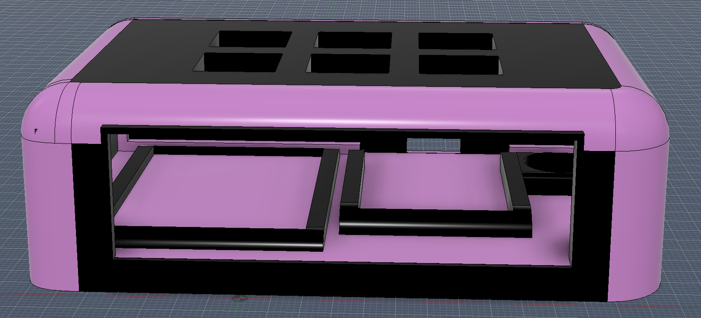
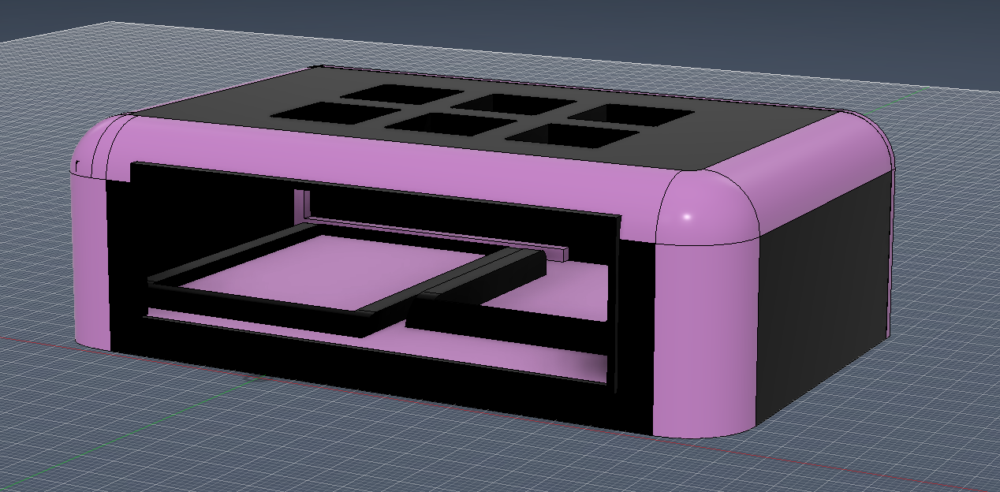
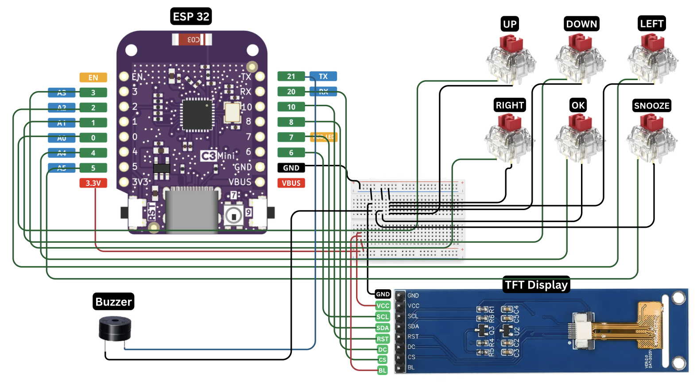

# Small, Simple Bedside Alarm Clock

A small bedside alarm clock built using a LOLA ESP32-C3!

## Features
- Syncs the clock over Wi-Fi using NTP on boot
- Shows time, date, and alarm status on the TFT screen, updated every second
- One alarm, set by hour and minute through the menu
- Enable/disable alarm with one button
- Snooze button, fixed 5-minute delay
- Stop button to silence a ringing alarm
- Switches between 12-hour and 24-hour display
- Menu: set alarm hour, set alarm minute, toggle 12/24h, toggle alarm on/off, exit
- Piezo buzzer beeps in pulses when the alarm rings
- Debounced button presses so each press registers once

## Hardware
- 1x Lolin C3 Mini ESP32 dev board
- 1x 2.25" TFT display (ST7789)
- 1x 3.3V piezo buzzer
- 1x PCB Breadboard
- 6x push buttons
- Jumper wires

## Software
- Arduino IDE
- Adafruit GFX
- Adafruit ST7789

## Case
A 3D printed case built to house the hardware (the PCB breadboard, ESP32, TFT Display, buzzer and jumper wires).

## Wiring

### TFT display

| Display pin | ESP32-C3 pin |
|------|------|
| VCC | 3.3V |
| GND | GND |
| SCL | GPIO 6 |
| SDA | GPIO 7 |
| RES | GPIO 10 |
| DC | GPIO 8 |
| CS | GPIO 20 |
| BL | 3.3V |

### Buzzer
- Positive lead - GPIO 21
- Negative lead - GND

### Buttons

| Button | GPIO |
|-----|-----|
| UP | 0 |
| DOWN | 1 |
| LEFT | 3 |
| RIGHT | 4 |
| OK | 5 |
| SNOOZE | 18 |

## Controls

- **OK** — open the menu / confirm a selection
- **UP / DOWN** — move through menu items
- **LEFT** — toggle 12-hour / 24-hour mode (outside the menu)
- **RIGHT** — toggle the alarm on or off (outside the menu)
- **SNOOZE** — snooze the alarm while it's ringing
- **UP** — stop the alarm while it's ringing

## Project structure

- `firmware/` — source code for the ESP32
- `cad/` — case and assembly files
- `wiring/` — wiring diagram / schematic
- `images/` — photos and screenshots

## Bill of materials

| Item | Quantity | Notes |
|---|---|---|
| ESP32-C3 dev board | 1 | Lolin C3 Mini |
| TFT display | 1 | 2.25" ST7789 |
| Piezo buzzer | 1 | 3.3V |
| Push buttons | 6 | Momentary switches |
| Jumper wires | - | Male/male, male/female, female/female |
| Case | 1 | 3D printed or custom enclosure |

---

**Built for Blare, A Hackclub YSWS**
